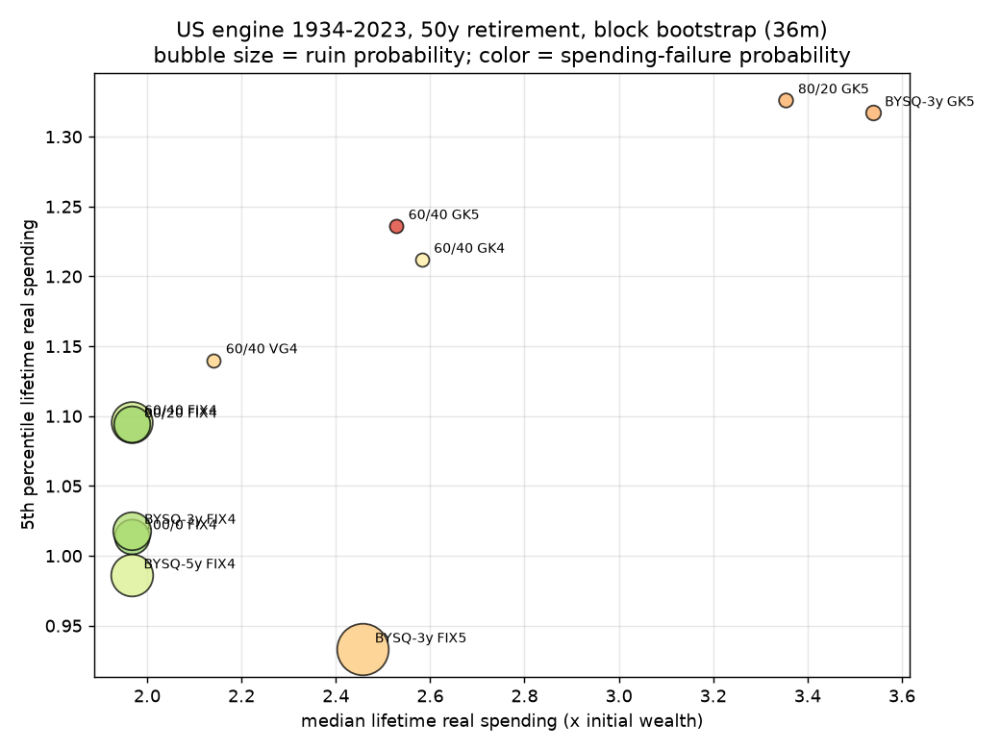
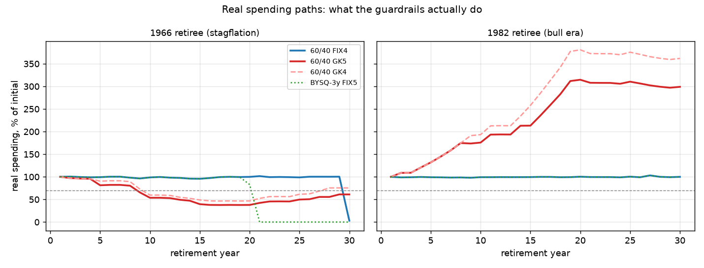

# 60/40、GK 護欄、BYSQ 現金桶：真實資料下的取捨地圖

**一句話結論**：在真實歷史資料下，這三種做法沒有誰「贏」——它們是在同一條取捨曲線上
賣不同的東西：固定 4% 賣「支出穩定」但長天期會破產；GK 賣「永不破產」但代價是
可能長達二十年的深度減支（以及一個宣傳上的幻覺：起始提領率其實不重要）；
BYSQ 現金桶在移除前視偏誤後，**沒有可量測的超額報酬價值**，它的價值若存在，
是行為上的、不在數字裡。

**成立前提**：美元資產（S&P + 10 年美債 + T-bill）、月頻、期初提領、無稅無費、
無勞保年金地板、決策只用 t−1 資訊。樣本止於 2023-07。台灣引擎見 §6 的重要警語。

---

## 1. 方法與可信度（為什麼這些數字可以信）

- **真實資料**：Shiller 月資料 1871–2023、FRED TB3MS / EXTAUS、主計總處 CPI（1981+）。
  無任何參數式生成資料。來源與缺口見 `data/PROVENANCE.md`。
- **共變異數保留**：所有序列綁同一條時間軸做 stationary block bootstrap
  （平均區塊 36 個月，敏感度 12/60），股債同跌、通膨與報酬的共變都在
  （測試：`tests/test_sanity.py::test_covariance_preservation`）。
- **無前視**：決策函式只看得到 t−1 以前；用「竄改未來報酬、比對決策不變」驗證，
  並用一個故意作弊的策略確認偵測器抓得到（HANDOFF §6.1）。
- **驗證關卡**：4% / 60-40 / 30 年、1926 年起每月起始：成功率 **97.9%**，
  落在 Bengen（100%）與 Trinity（95%）之間 → 引擎對得上文獻，才往下展開。
- 10,000 條路徑 × 3 個 seed；歷史重疊窗口另報。二項標準誤在 10k 路徑下約 ±0.3–0.5pp。
- 支出失敗（spend-fail）定義：實質支出低於初始 70% 且連續 ≥3 年（HANDOFF 指標 §5）。

## 2. 主表：美國引擎（1934–2023，含 1940s 與 1970s 通膨體制）

Bootstrap（36m 區塊，3 seeds 範圍），終身實質支出以「初始資產 = 1」為單位：

### 50 年提領期（長退休 / FIRE 情境）

| 策略 | 破產率 | 支出失敗率 | 終身支出 p5 | 終身支出中位 | 低於80%年數(中位/p90) |
|---|---|---|---|---|---|
| 60/40 固定4% | **19.2–20.2%** | 18.0–19.1% | 1.11 | 1.97 | 0 / 16 |
| 80/20 固定4% | 14.1–15.0% | 13.4–14.3% | 1.12 | 1.97 | 0 / 14 |
| 100/0 固定4% | 12.8–13.8% | 12.3–13.3% | 1.04 | 1.97 | 0 / 14 |
| BYSQ-3y 固定4% | 15.8–16.7% | 15.2–16.1% | 1.03 | 1.97 | 0 / 17 |
| BYSQ-5y 固定4% | 19.7–21.0% | 19.0–20.2% | 1.00 | 1.97 | 0 / 20 |
| BYSQ-3y 固定5% | **31.5–32.9%** | 30.6–32.2% | 0.94 | 2.46 | 0 / 28 |
| 60/40 GK 4% | ~0% | 26.7–28.0% | 1.23 | 2.61 | 0 / 33 |
| 60/40 GK 5% | ~0% | **42.8–44.3%** | 1.26 | 2.56 | 8 / 42 |
| 80/20 GK 5% | 0.1–0.2% | 33.8–35.1% | 1.34 | 3.40 | 0 / 37 |
| BYSQ-3y GK 5% | 0.5–0.6% | 33.7–35.2% | 1.34 | 3.59 | 0 / 37 |
| 60/40 Vanguard動態4% | ~0% | 30.2–31.5% | 1.16 | 2.15 | 0 / 39 |

歷史重疊窗口（無模型假設）方向一致：50 年 60/40 固定 4% 破產率 22.5%、
100/0 為 11.8%、GK5 破產 0% 但支出失敗 **76%**。

### 30 年提領期

| 策略 | 破產率 | 支出失敗率 | 歷史窗口破產率 |
|---|---|---|---|
| 60/40 固定4% | 6.2–6.5% | 4.3–4.9% | 2.4% |
| 100/0 固定4% | 6.5–7.0% | 5.3–5.9% | 0.7% |
| BYSQ-3y 固定4% | 7.3–7.8% | 5.8–6.3% | 3.2% |
| BYSQ-3y 固定5% | **19.1–19.3%** | 16.7–16.8% | **21.3%** |
| 60/40 GK5 | ~0% | 28.6–29.1% | 0%（但支出失敗 39.0%） |

## 3. 三個主角的「真實情況」

### 3.1 60/40 + 4%：30 年是一回事，50 年是另一回事

30 年下它大致守得住（歷史 2.4%、bootstrap ~6% 破產）。**拉到 50 年就翻臉：破產率
~20%，而且在美國樣本中它是三種配置裡最差的**——100% 股票 12.8%、80/20 14.5%。
原因不是股票不險，是長天期下債券擋不住通膨：1940s 與 1966–81 兩段通膨體制把
「安全資產」變成慢性毒藥。這正是 Cederburg 派的論點，在我們自己的資料上重現了。
但注意 §6：台灣引擎（1983–2023 樣本）給出**相反的排序**——結論是期間相依的。

### 3.2 GK 護欄:三個誠實的發現

**(a) 「永不破產」是真的，但價格標籤也是真的。** GK5 在 50 年期破產率 ~0%，
但 43–44% 的路徑會經歷連續 3 年以上實質支出低於初始 70%；一半路徑有 8 年以上
低於 80%，最壞十分之一有 42 年。1966 年退休者在 GK5 下的谷底是初始支出的
**38%**，且低於 80% 的狀態持續 22 年。「破產率 0%」和「過得好」是兩件事——
HANDOFF 預登記的證偽條件 H2（「若 GK 的支出失敗率高於固定提領的破產率，
則護欄只是把破產換成貧窮」）**在 4–5% 起始率下成立**：GK5 支出失敗 43% >
FIX4 破產 20%。

**(b) GK 會誤傷。** 1973 年退休者用固定 4% 其實全程撐得過去（一次都不用減支），
GK4/GK5 卻把他砍到初始的 47–52%，長達 17–21 年，最後留下比固定提領更多的遺產
——保護了資產負債表,方式是讓你白白窮了二十年。護欄沒有預知能力，它只是機械地
對回撤反應，事後看必然包含假警報。

**(c) 起始提領率是幻覺。** 掃描 2.5%–5.5% 起始率（50 年、60/40）：終身支出
第 5 百分位從 1.05 到 1.24，中位數全部收斂在 2.34–2.58——**起始率幾乎不影響
終身結果，連 2.5% 起始都有 11.5% 支出失敗率**。GK 文獻宣稱的「5.2–5.6% 安全
起始率」不是和 Bengen 4% 同一種商品：它實質上是一檔「支出隨資產表現浮動的
變動年金」，起始率只是第一年的出價。拿 GK 5% 和固定 4% 比「安全提領率」
是類別錯誤。

**(d) 沒人替 GK 說的優點：** 它真正的超額價值在**多頭**。1982 年退休者在 GK 下
終身實質支出是固定 4% 的 2.6–2.9 倍（繁榮規則把支出加上去了），而固定 4% 的人
守著 100% 的支出水位死去，留下 6.9 倍初始資產——那是沒花掉的人生。若以 CRRA
γ=4 的確定等值支出排序，GK 在所有策略中最高：厭惡毀滅性風險的人會理性地選它。

### 3.3 BYSQ 現金桶：把前視偏誤拿掉之後

- **桶本身沒有阿爾法。** BYSQ-3y（100% 股票 + 3 年桶、水位式補桶、無前視）的
  破產率精確落在其「有效股票占比」該有的位置：50 年期 15.8–16.7%，
  比 100/0（12.8–13.8%）**差**，比 60/40（19–20%）好。現金拖累吃掉的，
  比「低點不賣股」省下的多。加深到 5 年桶更差（19.7–21%）。
  舊版模擬裡桶策略的優勢，來自「用當年報酬決定當年動不動桶」的前視——
  那是白送的擇時能力，不是策略的功勞（HANDOFF 缺陷 #3，H1 證偽成功）。
- **桶的尺寸對不上真正的敵人。** 3 年桶蓋得住 2008（走 1.5 年）、蓋不住
  1966–1982（實質回撤 16 年）。1966 世代的 BYSQ-3y 在第 28 年破產，
  和 60/40 固定提領（第 29 年）沒有實質差別；BYSQ + 5% 提領在第 19 年就死了。
- **「桶讓你敢提 5%」是這次測試裡最危險的說法**：30 年破產 19%（歷史窗口 21%）、
  50 年破產 32%。
- **幣別問題比想像小**：台幣桶（假設實質利率 −1%/0%/+1%）與美元 T-bill 桶
  在台灣引擎的破產率差距在 1 個百分點內——桶太小，幣別錯配傷不了大局。
  真正的匯率暴露在那 88% 的股票上，桶解決不了。
- **公道話**:BYSQ-3y + GK5 與 80/20 + GK5 幾乎同一個點（p5 1.34、中位 3.4–3.6、
  破產 <1%）。如果桶的存在讓一個人**敢**持有高股票比例並在崩盤中不棄守，
  它的行為價值是真的——只是那不在報酬資料裡，在心理裡（HANDOFF §3.8 未建模）。

## 4. HANDOFF 預登記假說對答

| 假說 | 判定 | 證據 |
|---|---|---|
| H1: 100%股+桶在 5th-pct 上優於 60/40 | **部分成立但無意義** | p5 1.03 vs 1.11（60/40 略高）；破產率桶較低。桶的一切差異可由股票占比解釋，桶機制本身貢獻 ≈ 0 |
| H2: GK 優於固定提領 | **視你怕什麼而定** | GK 支出失敗率（43%）> 固定 4% 破產率（20%）→「把破產換成貧窮」成立;但 CRRA γ=4 下 GK 的確定等值最高 |
| H3: 2–3 年桶足夠 | **證偽** | 加深到 5 年反而更差（現金拖累），但 3 年桶也蓋不住 1966 型 16 年回撤——「足夠」的前提（桶是保命機制）本身不成立 |
| H4: 結論對區塊長度穩健 | **成立** | 12/36/60 個月區塊下所有排序不變（±1pp 內） |
| H5: 主引擎結論可推廣 | **證偽（重要）** | 台灣引擎（1983–2023）給出相反的配置排序，見 §6 |

## 5. 圖

右上角（高股票 + GK）在「中位 × p5」平面上支配其他所有點——但它的顏色
（支出失敗率 ~35%)提醒你代價收在第三個維度裡。沒有免費的點。

左：1966 世代——藍線（固定 4%）撐著 100% 到第 29 年斷崖歸零；紅線（GK5）
先跌到 40% 苟活二十年再爬回來；綠點線（桶+5%）第 19 年歸零。
右：1982 世代——GK 把支出推到 300–380%，固定 4% 平線到底，死時留 7 倍資產。

## 6. 台灣引擎的警語（這一節比主表重要）

台灣引擎（1983-11–2023-07，美元資產轉台幣、台灣 CPI 平減）給出的數字
**全面樂觀**（50 年 60/40 固定 4% 破產率只有 1.4–1.6%），且配置排序**與美國引擎
相反**（60/40 < 80/20 < 100/0）。原因不是台灣人有什麼優勢，而是這 40 年樣本
太仁慈：台幣計價全球股實質報酬約 8.9%/年、台灣通膨僅 1.6%/年、美債大多頭
40 年、台幣溫和升值。**這個樣本裡沒有任何一段長期通膨體制**——而長期通膨
正是美國引擎裡殺死 60/40 的那個東西。

HANDOFF 預言了這件事：「若情境間策略排序不一致,這本身就是主要發現。」
成立。**正確的讀法**：台灣引擎是「如果未來 50 年像過去 40 年」的上界;
美國引擎（含 1940s/1970s）是壓力情境。做決定要用後者，不是前者。
台美 CPI 年增率相關係數 0.51——台灣不會自動複製美國的通膨，但也沒有免疫。

## 7. 對 Clarence:四種讀法（不同的觀點,不是推薦）

- **Trinity/Bengen 傳統派**:「30 年、4%、60/40 沒問題。」真的——如果你的
  提領期是 30 年。50 年就不是這個世界了，別把 30 年文獻外推到 FIRE 時長。
- **Cederburg 派**：「長天期的真風險是通膨，債券是慢性毒藥，股票越多越安全。」
  美國 50 年資料支持（100/0 破產 13% < 60/40 20%）;但台灣引擎不支持，
  而且此派要你吞得下 p5 更低、途中回撤 -60% 不棄守。這是行為上限問題，
  不是數學問題。
- **GK 派**：「護欄讓你花更多且永不破產。」半真。真相是你買了一檔變動年金：
  多頭時它顯著讓你多花（這是它被低估的優點），空頭時它讓你窮而不死。
  簽約前看清楚 1966 年那條線:谷底 38%、二十二年低於八成。你的支出裡
  有多少是砍得掉的？如果地板（房租、健保、長照）超過初始支出的七成，
  GK 的「生存」對你就是違約。
- **BYSQ 派**：「現金桶讓你安心持股。」數字上桶 ≈ 持有等量現金的任何配置，
  機制本身無超額報酬,且 +5% 提領的版本在歷史上五分之一的窗口破產。
  但若「安心」讓你真的抱住 100% 股票穿越 -50%，行為價值可能超過現金拖累
  ——前提是你誠實回答:2008 年 10 月你會照 SOP 做，還是清倉？

**取捨的最短表述**：50 年期、以第 5 百分位終身支出為準——固定提領把尾部風險
收在「歸零」（機率 13–20%）；GK 把同樣的尾部風險攤成「長期七折以下的日子」
（機率 27–44%）；桶策略只是移動股票占比的滑桿。你能選的不是有沒有痛，
是痛的形狀。

## 8. 未建模清單（偏誤方向）

| 未建模 | 對結果的偏誤方向 |
|---|---|
| 稅（海外所得 100 萬門檻、20% 基本稅額）、內扣費、換匯價差 | 全體偏樂觀，高周轉策略（GK 的 PMR、桶的補桶）相對更受傷 |
| 勞保/勞退年金地板 | 對高股票配置偏悲觀（有地板時 100/0 更可辯護）——這是 Cederburg 結論的台灣版關鍵未知數 |
| 收入中斷×市場相關（累積期）、醫療支出斜率、行為棄守 | 未跑（HANDOFF §3.1/3.7/3.8）;行為棄守未建模對 100/0 與 GK 偏樂觀 |
| 全球股用 S&P 代理 | 對股票類策略偏樂觀（美國倖存者偏誤）,JST 面板未跑 |
| 樣本止 2023-07（缺 2024–25 多頭） | 全體偏保守 |
| 台海尾部風險、稅制修法、長照制度 | 無法量化,列出以免遺忘 |

殘留偏誤的淨方向：**多數偏樂觀**——和信貸研究一樣，這個模式本身就是資訊：
真實世界的數字會比本報告差一點,不會更好。

---

*重現：`python data/fetch.py && python tests/test_sanity.py && python run_experiments.py && python analyze.py && python figures.py && python cohorts.py`*
*引擎與資料版本見 git log;結果 CSV 在 `results/`。*
